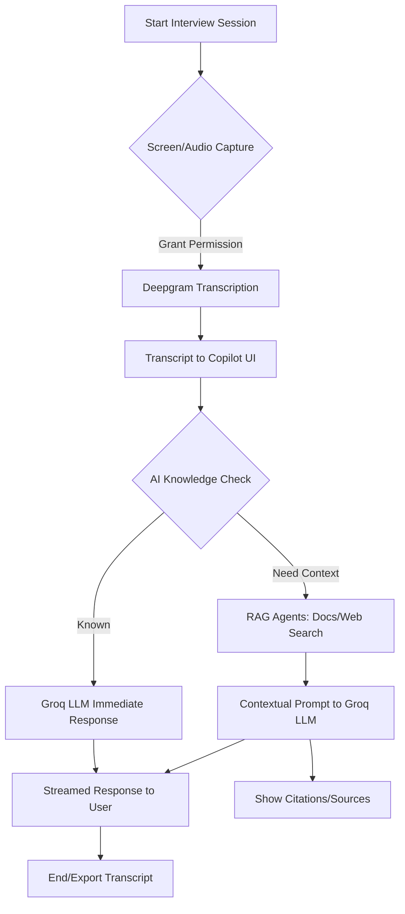

# AI Interview Copilot

<p align="center">
  
  
  
  
  
</p>

---

## Overview

**AI Interview Copilot** is a next-generation, real-time AI-powered assistant designed to streamline and enhance the technical interview process. Built for interviewers, hiring managers, and technical recruiters, this tool leverages state-of-the-art speech-to-text, large language models (LLMs), and retrieval-augmented generation (RAG) to provide instant, context-aware support during live interviews. The Copilot transcribes interviewer audio, analyzes candidate responses, and delivers intelligent, actionable suggestions, summaries, and follow-up questions—all in a clean, professional, and minimal UI.

---

## Features

### 🎙️ Real-Time Audio Transcription
- **Deepgram Integration:** Captures and transcribes interviewer/system audio in real time using advanced speech recognition.
- **Screen Sharing Preview:** Visual feedback for active screen/audio capture, with robust error handling and fallback logic.
- **Speaker Labeling:** Only "Interviewer" audio is transcribed and displayed, ensuring clarity and focus.

### 🤖 AI Reasoning & Response
- **Groq LLM Integration:** Utilizes Groq's ultra-fast, high-accuracy LLMs (Llama 3) for instant reasoning, explanations, and follow-up questions.
- **Intelligent Routing:** The system first checks if the LLM can answer from its own knowledge. If not, it automatically triggers RAG agents to fetch relevant context from documents, web, or company knowledge bases.
- **Progressive Enhancement:** Users receive immediate AI responses, with additional sources and citations appended as soon as RAG completes, minimizing wait time.

### 📚 Retrieval-Augmented Generation (RAG)
- **Contextual Search:** When the LLM needs more information, RAG agents search internal documents, PDFs, and web sources to provide accurate, context-rich answers.
- **Citations & Sources:** All RAG-based responses include clear, structured citations for transparency and auditability.

### 📝 Minimal, Professional UI
- **Clean Design:** No gradients, cards, or unnecessary UI elements—just a focused, distraction-free workspace.
- **Chat-Style Transcription:** All interviewer speech is displayed in a chat interface, with clear timestamps and speaker labels.
- **Screen Sharing:** Prominent, resizable preview for screen/audio capture, with live status indicators.

### 🛡️ Robustness & Security
- **Error Handling:** Graceful fallbacks for audio/video issues, API errors, and permission denials.
- **Environment Variables:** All API keys and sensitive configs are managed via `.env` files.
- **No Candidate Audio:** Only interviewer/system audio is captured, ensuring privacy and compliance.

---

## System Flowchart



---

## Architecture Diagram

```mermaid
graph LR
    subgraph Frontend
      A1[User (Interviewer)]
      A2[Screen/Audio Capture]
      A3[Copilot UI]
    end
    subgraph Backend
      B1[API Route: /api/completion]
      B2[Groq LLM]
      B3[RAG Orchestrator]
      B4[Deepgram Transcription]
      B5[Document & Web Search]
    end
    A1 --> A2
    A2 --> B4
    B4 --> A3
    A3 --> B1
    B1 --> B2
    B1 --> B3
    B3 --> B5
    B3 --> B2
    B2 --> A3
    B3 --> A3
```

---

## Architecture

- **Frontend:** Next.js, React, Tailwind CSS
- **Audio/Video:** Web APIs for screen/audio capture, Deepgram SDK for transcription
- **AI/LLM:** Groq SDK for Llama 3 models, with intelligent routing between LLM and RAG
- **RAG:** Modular agents for document, PDF, and web search (Pinecone, Tavily, etc.)
- **Backend:** API routes for streaming LLM responses, RAG orchestration, and context management

---

## Getting Started

### 1. Clone the Repository
```bash
git clone https://github.com/your-org/ai-interview-copilot.git
cd ai-interview-copilot
```

### 2. Install Dependencies
```bash
npm install
# or
yarn install
```

### 3. Configure Environment Variables
Copy `.env.example` to `.env` and fill in your API keys:
```bash
cp .env.example .env
```
- `GROQ_API_KEY` (Groq LLM)
- `NEXT_PUBLIC_DEEPGRAM_API_KEY` (Deepgram)
- `PINECONE_API_KEY`, `TAVILY_API_KEY`, etc. (for RAG)

### 4. Run the App
```bash
npm run dev
# or
yarn dev
```
Visit [http://localhost:3000](http://localhost:3000) to use the Copilot.

---

## Usage

1. **Start Screen Sharing:** Click "Connect" to begin capturing interviewer audio and screen.
2. **Live Transcription:** The Copilot will transcribe all interviewer speech in real time.
3. **Ask Questions:** Type or speak interview questions; the Copilot will provide instant AI-powered suggestions and follow-ups.
4. **Review Sources:** If the AI needs more context, sources and citations will appear after the initial response.
5. **Export/Save:** Download or copy chat transcripts for record-keeping or feedback.

---

## Advanced Capabilities

- **Intelligent LLM Routing:** The Copilot uses a knowledge-check prompt to decide if the LLM can answer directly. If not, it triggers RAG for deeper context.
- **Streaming Responses:** All AI and RAG responses are streamed for minimal latency.
- **Customizable Models:** Easily switch between Groq, Gemini, or OpenAI by updating environment variables and config files.
- **Extensible RAG Agents:** Add new document or web search agents by extending the RAG orchestrator.

---

## File Structure

- `/app` - Next.js app, API routes, and main pages
- `/components` - UI components (recorder, chat, PDF manager, etc.)
- `/lib` - Core logic (transcription manager, LLM/RAG clients, utils)
- `/public` - Static assets
- `/scripts` - Setup and utility scripts
- `/docs` - Technical and integration documentation

---

## Contributing

1. Fork the repo and create a feature branch.
2. Make your changes with clear, well-documented code.
3. Add/modify tests as needed.
4. Submit a pull request with a detailed description.

---

## Troubleshooting

- **Audio/Screen Not Captured:** Ensure browser permissions are granted for screen and audio.
- **API Errors:** Check your `.env` file for correct API keys and quotas.
- **Slow Responses:** RAG-based answers may take longer; LLM-only answers are near-instant.
- **UI Issues:** Clear browser cache or try a different browser.

---

## License

MIT License. See [LICENSE](./LICENSE) for details.

---

## Acknowledgments

- [Deepgram](https://deepgram.com) for real-time transcription
- [Groq](https://groq.com) for ultra-fast LLMs
- [Pinecone](https://pinecone.io) and [Tavily](https://tavily.com) for RAG/search
- [Next.js](https://nextjs.org), [React](https://react.dev), and [Tailwind CSS](https://tailwindcss.com) for the frontend

---

## Contact

For support, feature requests, or enterprise solutions, please contact the maintainers or open an issue on GitHub.
